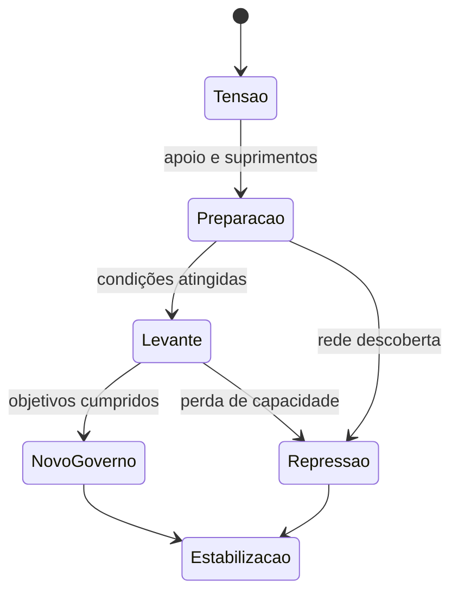

# Lunar RPG — Conceito e direção de jogo

**Versão 0.2** · atualizado em 6 de setembro de 2026

Documento vivo: ele muda quando as ideias mudarem. O registro do que mudou fica na seção 20.

Este documento guarda só a concepção do jogo:

- o que ele é;
- o que o jogador faz;
- o que o mundo promete;
- onde ficam os limites de escopo.

Decisões de implementação — ferramentas, formatos, testes e distribuição — ficam no documento de arquitetura e plano.

As quantidades de conteúdo citadas aqui são hipóteses de escopo, não requisitos aprovados.

Os termos próprios do projeto estão explicados no glossário, na seção 19.

## 1. A ideia central

Um RPG singleplayer de pilotagem e trabalho espacial em 2D, inspirado em Lunar Lander e na ficção científica visual dos anos 80.

A nave é o personagem principal. Transporte, mineração, resgate, combate e política usam os mesmos recursos e produzem as mesmas consequências:

- o motor que o jogador usa para pousar é o mesmo que leva dano no combate;
- a carga resgatada ocupa o mesmo porão da carga comercial.

O que o jogo se propõe a entregar:

- Mundo e pilotagem 2D, com estética retrô dos anos 80.
- Nave controlada diretamente, com inércia, pouso, combustível, carga e melhorias.
- Contratos de transporte, resgate e mineração; créditos e progressão.
- Planetas com diferenças físicas, econômicas e políticas.
- Combate conectado à pilotagem e aos danos da nave.
- Escolhas entre trabalho legal, pirataria, contrabando e envolvimento político.
- Viagens que conectam os sistemas sem exigir percorrer todo o vazio em tempo real.

## 2. Princípios de experiência

1. **Pilotagem antes de quantidade de conteúdo.** Uma nave e três plataformas precisam ser divertidas antes de o jogo ganhar a quarta plataforma.
2. **Consequências legíveis.** O jogador entende por que colidiu, por que perdeu carga e por que foi identificado.
3. **Falhar gera uma situação nova.** Dano, resgate e perda parcial acontecem antes de a campanha se encerrar.
4. **Profissões compartilham sistemas.** Cada profissão usa os sistemas que já existem, em vez de ganhar mecânica isolada só dela.
5. **Complexidade progressiva.** Calor, tripulação e política entram depois que o jogador aprendeu os controles básicos.
6. **Respeito ao tempo do jogador.** O jogo pausa, salva, avança rápido até as decisões relevantes e nunca exige ficar aberto para progredir.

## 3. Escopo

Uma ideia boa pode esperar. A tabela separa o que entra na primeira versão do que fica para depois.

| Área | Primeira versão | Expansão posterior |
| --- | --- | --- |
| Universo | Um sistema fictício, três corpos visitáveis e uma estação orbital | Novos sistemas e viagens exóticas |
| Superfícies | Oito regiões autorais, distribuídas entre os três destinos (3 + 3 + 2) | Mais biomas e geração extensa |
| Destinos | Lua industrial, planeta desértico e asteroide com atividade criminosa | Mundo oceânico, gigante gasoso e vulcanismo |
| Naves | Três cascos, slots predefinidos, 18–24 módulos e equipamentos | Construção livre peça a peça, grandes frotas |
| Mercado | Oito mercadorias, estoques por porto e logística agregada | Cadeias industriais extensas |
| Missões | Cinco famílias: transporte, resgate, mineração, interceptação e extração | Mais variações e profissões |
| Política | Três facções ativas e um conflito regional com desfechos | Guerras generalizadas e diplomacia entre sistemas |
| Narrativa | Um arco autoral de 6–8 missões, com contratos repetíveis ao redor | Várias campanhas e histórias da tripulação |
| Tripulação | Até três especialistas, com competências, ferimentos e eventos limitados | Relações sociais extensas e simulação individual |
| Combate | Poucos inimigos, dano por módulo, fuga, rendição e extração | Batalhas de frotas e combate a pé |
| Destruição | Depósitos mineráveis e estruturas destrutíveis selecionadas | Terreno arbitrário deformável, fluidos e desmoronamentos |

Os três corpos do sistema são ficcionais. Isso permite ajustar as condições deles à diversão, sem prometer fidelidade a planetas reais.

### 3.1 Fora da primeira versão

- Multiplayer.
- Física gravitacional de muitos corpos.
- Campanha que avança enquanto o jogo está fechado.
- Cidades caminháveis.
- Combate terrestre controlado diretamente.
- Frota administrável.
- Terreno integralmente destrutível.

Guerra e abordagem de nave continuam existindo, em versões mais baratas:

- **Guerras** são mudanças de estado do mundo, acompanhadas por operações locais que o jogador executa.
- **Abordagens** são decisões e etapas de extração feitas pela interface.

Nenhuma das duas simula milhares de soldados ou comerciantes individualmente.

### 3.2 A primeira experiência completa

Um trecho curto de 30–45 minutos que reúne as partes essenciais do jogo, em dois corpos celestes, três regiões e uma estação:

1. Aceitar e realizar um frete; aprender a pousar com carga.
2. Receber créditos e escolher entre reparar ou melhorar um equipamento.
3. Aceitar a extração de um prisioneiro em trânsito.
4. Planejar a viagem e chegar a um encontro com um transporte.
5. Usar uma autorização obtida antes ou incapacitar a escolta.
6. Transferir o prisioneiro, fugir e pousar com o dano persistente.
7. Ver a reputação e a disponibilidade de contratos mudarem.
8. Fechar e reabrir o jogo, retomando a campanha corretamente.

Essa sequência valida a identidade do RPG e do combate. Se ela não funcionar, o próximo passo é revisar controles e objetivos, não multiplicar planetas.

## 4. Pilotagem

**Inércia e massa**

- A nave tem inércia.
- A massa altera a aceleração sob o mesmo empuxo.
- O consumo depende do comando efetivamente aplicado, inclusive o da estabilização automática.
- Carga pesada é sentida no controle, não apenas anunciada num número.

**Propulsão**

- O propulsor principal empurra no eixo da nave.
- Os propulsores de manobra produzem translação e giro.
- Dano reduz a capacidade real: perder empuxo ou eficiência muda como se voa.

**Estabilização angular**

Existe desde o início, como acessibilidade.

- Gasta combustível e respeita os limites da nave.
- Upgrades ampliam eficiência ou capacidade.
- O jogo nunca cobra créditos para corrigir um controle frustrante.
- O piloto automático barato funciona. Ele não recebe falhas aleatórias como substituto de dificuldade bem desenhada.

**Pouso é um estado, não um único evento de colisão**

Entram na avaliação:

- velocidade relativa à plataforma;
- ângulo de impacto;
- inclinação e giro;
- contato das pernas;
- tempo estável.

Por isso, um toque de raspão não é o mesmo que um impacto frontal, e uma colisão pode ser sobrevivível: quebrar uma perna e ainda entregar parte da carga é um desfecho legítimo. Pousar sobre plataforma móvel considera o movimento dela.

**Sinais de que a pilotagem está certa**

- Parada no chão, a nave não se move sozinha.
- Desligar os motores no vácuo não freia.
- Peso extra reduz a aceleração.
- Combustível zero limita o empuxo.

## 5. Nave, equipamentos e progressão

**Cascos e módulos**

- Cada casco define slots, silhueta, limite de carga e resistência estrutural.
- Cada módulo tem massa, consumo, integridade e capacidades.
- A nave é a soma do que está instalado, menos o que está quebrado.

Slots previstos: motor principal, controle de manobra, tanque, compartimento de carga, utilidade, arma e defesa/sensor. Nem todo casco tem a mesma combinação. Encaixe espacial livre, fiação e tubulação individuais ficam fora.

**Progressão horizontal**

Três papéis de casco: utilitário leve, cargueiro resistente e interceptador. Todo equipamento cobra o seu preço em massa, energia, espaço, combustível ou manutenção. Não existe upgrade que só melhore.

**Ordem em que os recursos entram no jogo**

1. Combustível, estrutura e carga.
2. Dano por módulo e munição.
3. Energia e calor, só quando o combate ou a mineração criarem uma decisão real.

A primeira missão nunca mostra seis barras sem função perceptível.

**Dano e recuperação**

- Módulos passam por três estados: íntegro, degradado e desativado.
- Integridade estrutural é separada de capacidade funcional: dá para perder motores sem explodir.
- Reparo restaura o módulo. Substituição troca a peça.

**Saída da espiral de pobreza**

Sempre existe um caminho verificável de volta ao trabalho: serviço emergencial, contrato básico viável ou recuperação com penalidade limitada. Nenhuma decisão garante lucro, mas dá para consertar a nave e voltar a trabalhar depois de um fracasso. Perda permanente da campanha é opção de dificuldade, não a regra.

## 6. Controles, câmera e legibilidade

**Controles**

- Teclado e controle levam ao mesmo conjunto de ações: intensidade do propulsor, rotação, translação lateral, mira e comandos.
- Os inimigos voam sob as mesmas regras do jogador. Nenhuma nave se move por teleporte.

**Mira**

O combate inicial usa uma torre com arco limitado, apontada por mouse ou analógico direito, e o movimento não fica preso à mira. No controle, seleção de alvo e assistência opcional entram em teste. Armas fixas e combinações mais exigentes vêm depois.

**Câmera**

- Antecipa o movimento com moderação, mantendo nave e área de pouso legíveis.
- O zoom tem limites: distância astronômica é assunto do mapa.
- Nenhuma ação essencial depende de passar o mouse por cima.

**Pausa e dispositivos**

- Menus de administração e pausa param o tempo. Inspecionar a situação com o jogo pausado não é punido.
- Trocar de dispositivo, desconectar o controle ou voltar de uma suspensão nunca deixa o propulsor travado ligado.

## 7. Mundo: planetas, regiões e permanência

**Composição de um planeta**

Um planeta é um conjunto de condições físicas mais um estado econômico e político, com regiões visitáveis. Cada região tem terreno, plataformas, clima, pontos de interesse e marcadores de missão. As regiões são autorais, com variações por clima, facção e estado das construções.

**Perspectiva**

Pilotagem e combate acontecem sempre com a mesma nave vista de perfil, em 2D. O mapa orbital é uma camada estratégica à parte, não uma mudança de perspectiva. As superfícies são regiões locais: o jogador não precisa dar a volta física num planeta.

**Mineração e destruição seletiva**

- Depósitos são alvos com quantidade, dureza e qualidade, e o laser os consome em partes.
- Minas e bases têm estruturas destrutíveis escolhidas na produção.
- Isso entrega mineração e sabotagem sem prometer terreno deformável em qualquer ponto.

**O mundo lembra**

Permanecem no mundo: depósito exaurido, estrutura destruída, nave abandonada, carga deixada para trás e controle de uma instalação. Destroços decorativos somem com o tempo; destroços de missão e carga recuperável ficam, mesmo com o cenário cheio.

**Troca de governo**

Mudar quem governa um lugar muda contratos, permissões, bandeiras e quem está presente, sem duplicar o mapa para cada desfecho.

## 8. Tempo e o mundo que continua

Existe um relógio de campanha, e ele só avança com o jogo aberto. Salários, produção, contratos e clima consultam esse relógio.

| Situação | O que acontece com o tempo |
| --- | --- |
| Voo ou combate | Corre normalmente |
| Menus, planejamento e pausa | Parado |
| Reparo ou serviço de porto | Duração informada antes de confirmar |
| Cruzeiro entre destinos | Avança até o próximo evento ou decisão |
| Jogo fechado | Nada acontece |

**Ritmo.** Produção e política evoluem em ritmo próprio, não a cada segundo.

**O avanço rápido para no problema.** Se a tripulação fica sem suprimento no terceiro dia de uma viagem de trinta, o jogo interrompe no terceiro dia. O mesmo vale para uma emboscada: o encontro começa com aviso e distância coerentes, dando oportunidade de reação. A ameaça pode ser difícil, mas a surpresa precisa ser justa.

**O mundo distante** é representado por fluxos e rotas, com alguns transportes relevantes existindo individualmente. Uma nave capturada para de entregar a carga antiga no mesmo instante.

## 9. Viagens entre corpos

**O mapa**

Um mapa 2D com posições orbitais simplificadas e rotas calculadas. Sem solver de órbitas reais e sem trajetórias decorativas vendidas como precisão astronômica.

**A escolha de rota**

Quando disponíveis, o jogador escolhe entre rota econômica, rápida e clandestina. Cada uma informa duração, combustível esperado, reserva de chegada, infraestrutura, fiscalização e incertezas conhecidas.

O mapa mostra exatamente a mesma conta que o jogo vai executar. O jogo não promete autonomia impossível.

**Partida e chegada**

- A decolagem começa manualmente na região. Ao atingir a condição de saída, uma etapa de ascensão representa o resto do trajeto.
- A chegada tem desaceleração planejada e depois uma região de aproximação e pouso.
- Cruzar o topo da tela não coloca a nave em órbita: é preciso condição de voo e recursos, e o custo é informado antes da partida.

**A reserva de chegada é informação, não combustível intocável.** Gastá-la num combate reabre a pergunta de como chegar: desvio, abastecimento ou resgate.

**Recálculo de rota**

Mudança de massa, dano de motor, destino bloqueado ou carga extra invalidam a previsão e forçam recalcular o restante da rota. O trecho já percorrido não é cobrado de novo.

Uma falha significativa oferece escolha: abandonar carga, aceitar reboque, usar um porto caro, adiar o contrato ou negociar. Decisões logísticas interessantes não dependem de assistência gravitacional.

**Encontros e fuga**

- Interceptações dependem de rotas, sensores, risco e de quem realmente existe naquele trecho.
- Eventos raros têm causa, frequência máxima e consequência clara.
- Fugir exige separação real. Tocar a borda da tela não conta.
- Sair e voltar não cura o inimigo nem apaga a perseguição.

## 10. Combate

Confrontos curtos ou moderados, com poucas naves e objetivos funcionais. O mesmo motor, combustível e casco continuam ali depois da batalha.

**Cinco desfechos, todos válidos:** destruir, desarmar, imobilizar, intimidar e fugir.

**Arsenal inicial pequeno**

Uma arma cinética, uma ferramenta de mineração e uma forma de incapacitar com regras claras. Mísseis guiados, minas, enxames de drones e escudos complexos ficam para depois. A variedade vem de objetivo, terreno, massa, posicionamento e dano funcional: o primeiro duelo precisa funcionar antes de existirem vinte armas.

**Dano**

Atinge módulos em regiões do casco. Desligar um motor deixa a nave vulnerável, mas não apaga instantaneamente a velocidade que ela já tinha.

**Os pilotos inimigos sabem apenas o que percebem.** Sem detecção ou mensagem, a IA não sabe onde está uma nave que saiu do alcance.

**O sistema criminal** registra incidentes, autoria conhecida, testemunha ou transmissão, e jurisdição. Um ataque sem testemunha não é automaticamente invisível: a vítima pode ter transmitido antes de ser calada. O jogador precisa ouvir esses sinais para entender o risco que está correndo.

**Rendição é condição funcional e moral**, não uma porcentagem de vida. Pesam na decisão as armas restantes, a chance de fuga, a ameaça e o histórico do jogador.

**Abordagem**

- Exige alvo incapacitado ou cooperativo, aproximação estável e equipamento de transferência.
- A extração acontece em etapas pela interface, com tempo, risco e escolhas. Não há interior caminhável.
- Passageiros, presos e sobreviventes são pessoas com condição e localização próprias. Um prisioneiro transferido sai do manifesto inimigo no mesmo instante.
- Uma nave capturada pode ser rebocada, vendida ou reclamada num porto. Isso não abre um sistema de frotas.

## 11. Contratos e narrativa

**Famílias iniciais de missão:** transporte, resgate, mineração, interceptação e extração.

Cada missão tem contratante, participantes concretos, prazo, progresso, escolhas e desfecho. Concluir um objetivo é diferente de receber o pagamento.

**Objetivos são combinações de peças simples:** chegar a um lugar, entregar carga, coletar recurso, extrair pessoa, incapacitar alvo e retornar.

**Contratos gerados obedecem a restrições, não a sorteio livre:**

- origem e destino existem e são alcançáveis;
- o alvo está vivo e no lugar que a missão indica;
- a oferta combina com o nível do jogador, ou está claramente marcada como difícil;
- o prazo é plausível para a rota;
- requisitos de carga, passageiro e equipamento são explícitos;
- a recompensa cobre custo operacional e risco.

Ofertas expiram. O quadro de contratos não reserva o mundo inteiro para propostas que ninguém aceitou.

**Autoral primeiro, procedural depois.** Cada família ganha exemplos escritos à mão antes de virar variação gerada. O arco do prisioneiro tem ramos escolhidos, não uma simulação universal de conspirações.

**Missões reagem ao mundo.** O contratante pode perder o porto, o alvo pode morrer, a carga pode ser destruída e o prazo pode acabar. Cada caso tem política definida: falha, compensação, novo destino ou cancelamento. Nenhuma missão fica eternamente ativa com objetivo impossível e sem explicação.

## 12. Economia e logística

**Os mercados vivem nos portos**

- Cada mercadoria tem preço-base, unidade, massa e regras de legalidade.
- Cada porto tem estoque, capacidade, produção, consumo e metas de reserva.
- O preço reage à distância entre o estoque atual e o desejado, dentro de limites, e recebe modificadores de logística, imposto, bloqueio e reputação.

**Compra e venda** têm preços diferentes, e o comércio interplanetário continua valendo a pena. Vender um lote grande derruba o preço durante a venda: mil unidades não saem todas pela cotação de escassez.

**Economia simulada não exige simular todo agente.** Fluxos de importação e exportação mantêm o mundo funcionando, limitados pela capacidade das rotas, e alguns comboios representam uma parte identificável desses fluxos. Piratear um transporte reduz um lote de abastecimento: uma nave sozinha não derruba a economia de um planeta, mas interferências sucessivas e objetivos de campanha podem produzir efeitos grandes.

**De onde vem o dinheiro**

Lucro por rota é o jogo funcionando. Crédito criado por inconsistência é bug. Toda entrada e saída de crédito é declarada: contratos, comércio, taxas, combustível, reparo e módulos.

Contratos de recuperação podem ter subsídio deliberado, para impedir que o jogador trave sem dinheiro. Esse subsídio é regra de design registrada, não torneira acidental.

## 13. Facções, conflito e tripulação

**Três grupos ativos:** autoridade corporativa, movimento colonial rebelde e rede pirata. Civis e comerciantes neutros existem sem virar mais uma diplomacia completa.

**Três eixos de reputação bastam:**

1. confiança de cada facção;
2. notoriedade e procura por jurisdição;
3. controle territorial.

Com isso já é possível ser útil aos piratas e procurado num porto ao mesmo tempo. Governo de um planeta, dono de uma instalação e facção de um personagem são coisas distintas: um esconderijo pirata pode existir em território governado por outra facção.

**O conflito regional é um arco com estados:**

Cada estado muda contratos, fiscalização, disponibilidade e preços através dos sistemas que já existem. O arco autoral escolhe objetivos que influenciam esses estados, sem criar uma economia paralela.

**Aviso antes do irreversível.** O mundo pode avançar sem o jogador, mas decisões irreversíveis de um arco aceito precisam de prazo e aviso claros. Uma viagem não pode apagar em silêncio a história principal.

**Toda mudança observável precisa ser explicada:** notícia sobre um bloqueio, mensagem de um contato, bandeira trocada no porto, quadro de contratos diferente. Mexer só em números ocultos não produz sensação de mundo vivo.

**Tripulação contida**

- Especialistas em reparo, medicina, mineração e negociação acrescentam competências e pequenas opções.
- Ferimentos e suprimentos são estado persistente.
- Ficam fora: rotinas, movimentação dentro da nave, genealogia e relações entre todos.
- O suporte de vida começa como autonomia agregada por ocupante. Separar água, alimento e oxigênio só se cada um criar uma decisão de verdade.

## 14. Direção visual e sonora

**Estética retrô com leitura moderna**

- A interface fica em camada própria e escalável, para não sacrificar texto econômico em tela pequena.
- O filtro de pixelização é separado do que o jogo considera colisão. Nenhuma escolha estética deixa o casco tremido ou a mira imprecisa.
- CRT, scanlines, brilho e ruído são opcionais e nunca chegam a comer a informação de missão. A interface fica fora da distorção.

**Identificação**

- Paletas por planeta, silhuetas por facção e indicadores de dano consistentes.
- Cor sozinha nunca distingue inimigo, aliado e objetivo.
- Arte final não é pré-requisito para provar que a pilotagem e o combate funcionam.

**Som**

O que importa é o sinal útil: aproximação do limite de pouso, motor falhando, combustível crítico, travamento de alvo. A música nunca esconde um alerta.

**Idiomas**

Os textos são preparados para inglês e português brasileiro.

## 15. Promessas ao jogador

- Pausar e salvar sem perder progresso, com o jogo informando com clareza onde é possível salvar em cada fase do desenvolvimento.
- Nada acontece na campanha enquanto o jogo está fechado.
- Fracassar não é o fim: existe um caminho de volta ao trabalho depois de perder a nave, o combustível e quase todos os créditos.
- Todo desfecho ruim tem causa compreensível.
- Nenhuma missão fica pendurada para sempre sem objetivo possível.
- Uma ameaça pode ser difícil, mas sempre dá a chance de reagir.
- Assistência de controle é acessibilidade, não item de loja.

## 16. Quando parar e revisar o design

- Se o pouso continuar imprevisível, suspender conteúdo e revisar a pilotagem e a assistência.
- Se pilotar e mirar ao mesmo tempo sobrecarregarem o jogador, revisar controle, torre e pausa antes de adicionar armas.
- Se a viagem não produzir decisões, simplificá-la antes de sofisticar as órbitas.
- Se a economia criar contratos inviáveis ou pobreza sem saída, corrigir as regras antes de abrir novos mercados.
- Se a estética retrô prejudicar a leitura, ajustar a apresentação antes do acabamento.

## 17. Riscos do produto

| Risco | Sinal antecipado | Resposta prevista |
| --- | --- | --- |
| Escopo maior que a capacidade | Ciclos terminam sem nada jogável | Cortar quantidade de conteúdo e adiar sistemas da coluna de expansão |
| Sobrecarga de controles | O jogador luta com a interface durante o pouso | Assistência básica, pausa, torre limitada e redistribuição de ações |
| Economia instável | Mercados mortos, dinheiro infinito ou miséria permanente | Limites de preço e estoque, e caminho de recuperação explícito |
| Inimigos que não sabem voar | Colisões constantes ou perseguição infinita | Corredores autorais, objetivos limitados e as mesmas regras de voo do jogador |
| Mundo que muda sem explicação | O jogador não entende por que um contrato sumiu | Notícia, mensagem ou marca visível para toda mudança relevante |
| Arte final atrasada | Placeholder chega ao acabamento | Definir o inventário e o orçamento de arte depois da primeira experiência completa |

## 18. Perguntas em aberto

- Nome e ambientação final.
- Estilo visual dominante.
- Duração comercial pretendida.
- Existência de um modo com perda permanente.
- Qual sensação de voo o jogo quer exatamente. Essa decisão só faz sentido diante de um protótipo, não de uma descrição.

**Em resumo:** preservar a ambição na interação entre os sistemas, controlar o escopo pela quantidade de mundos, armas e histórias, e tratar cada fracasso do jogador como o começo de uma situação nova.

## 19. Glossário

| Termo | Significado |
| --- | --- |
| **Casco** | O chassi da nave. Define slots, silhueta, limite de carga e resistência estrutural. |
| **Slot** | Encaixe fixo do casco que aceita um tipo de módulo. |
| **Módulo** | Peça instalável num slot, com massa, consumo, integridade e capacidades. |
| **Região** | Área local visitável de um planeta, com terreno, plataformas, clima e pontos de interesse. O jogo não representa o planeta inteiro. |
| **Depósito** | Alvo minerável com quantidade, dureza e qualidade, consumido em partes pelo laser. |
| **Extração** | Transferência de pessoa ou carga entre naves ou instalações, resolvida em etapas pela interface, sem interior caminhável. |
| **Progressão horizontal** | Evolução por troca de papel e de compromisso, não por números sempre maiores. Todo equipamento cobra preço em massa, energia, espaço, combustível ou manutenção. |
| **Reserva de chegada** | Combustível que o plano de rota separa para as manobras de aproximação e pouso. É informação exibida, não um bloqueio. |
| **Logística agregada** | Comércio distante representado por fluxos e capacidade de rota, em vez de comerciantes simulados um a um. |
| **Autonomia agregada por ocupante** | Suporte de vida contado como dias de autonomia por pessoa a bordo, sem separar água, alimento e oxigênio. |
| **Corredores autorais** | Caminhos de voo desenhados à mão numa região, usados pela IA inimiga para se mover de forma legível. |
| **Primeira experiência completa** | O trecho de 30–45 minutos da seção 3.2, que exercita todos os sistemas essenciais de ponta a ponta. |

## 20. Histórico de versões

| Versão | Data | O que mudou |
| --- | --- | --- |
| 0.2 | 2026-09-06 | Reescrita para linguagem direta: parágrafos longos viraram listas, voz padronizada em "o jogador", glossário e histórico adicionados. Nenhuma decisão de design mudou. |
| 0.1 | 2026-09-06 | Primeira versão do conceito. |
