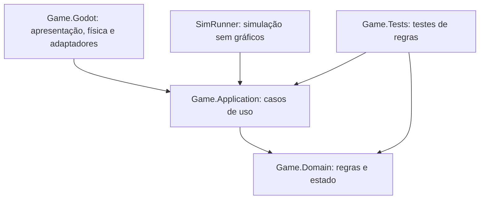
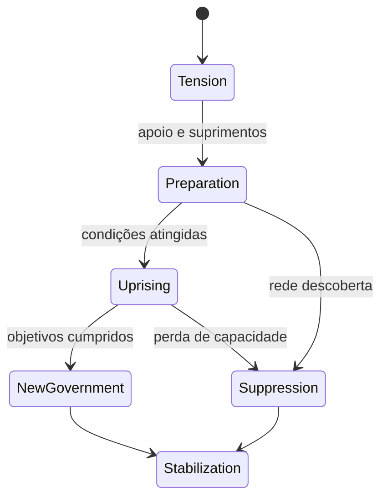

# Lunar RPG — Arquitetura e plano de desenvolvimento

Versão 0.1 · 5 de setembro de 2026 · Documento de projeto, ainda sem implementação

**Direção:** um RPG singleplayer de pilotagem e trabalho espacial em 2D, inspirado em Lunar Lander e na ficção científica visual dos anos 80. A nave é o personagem principal. Transporte, mineração, resgate, combate e política compartilham recursos e consequências.

Este plano consolida a conversa e propõe decisões de implementação. As quantidades de conteúdo, parâmetros de física e metas de desempenho abaixo são hipóteses de produção, não requisitos já aprovados nem resultados medidos. Não foram criados o jogo, repositório remoto ou integração Steam nesta etapa.

Leitura rápida: seções 1–3 para escopo e stack; 4–17 para implementação dos sistemas; 18–20 para desempenho, testes e Steam; 21–26 para marcos, riscos e próxima entrega. O texto descreve o projeto futuro; somente este documento foi produzido nesta etapa.

## 1. Decisão executiva

Construir um **monólito modular orientado a dados**: um único aplicativo desktop, sem backend, com limites claros entre regras, coordenação, física e apresentação. Usar Godot .NET e C#; simular fisicamente apenas a região ativa; representar o restante do universo por estados, rotas e eventos agendados.

A arquitetura deve permitir evoluir o jogo sem exigir que economia, guerras e viagens sejam implementadas antes de testarmos um pouso. Seu objetivo é reduzir o custo de mudança, não prometer uma estrutura definitiva imune a refatoração.

### 1.1 Requisitos estabelecidos na conversa

- Estritamente singleplayer, com lançamento desejado na Steam.
- Mundo e pilotagem 2D; estética retrô inspirada nos anos 80.
- Nave controlada diretamente, com inércia, pouso, combustível, carga e melhorias.
- Contratos de transporte, resgate e mineração; créditos e progressão.
- Planetas com diferenças físicas, econômicas e políticas.
- Combate conectado à pilotagem e aos danos da nave.
- Escolhas entre trabalho legal, pirataria, contrabando e envolvimento político.
- Viagens que conectam os sistemas, sem exigir percorrer todo o vazio em tempo real.

### 1.2 Princípios de experiência

1. **Pilotagem antes de quantidade de conteúdo.** Uma nave e três plataformas precisam ser divertidas.
2. **Consequências legíveis.** O jogador deve entender por que colidiu, perdeu carga ou foi identificado.
3. **Falhar gera uma situação nova.** Danos, resgate e perda parcial precedem o encerramento da campanha.
4. **Profissões compartilham sistemas.** A carga resgatada usa o mesmo inventário que a carga comercial; o motor atingido é o mesmo usado no pouso.
5. **Complexidade progressiva.** Calor, tripulação e política aparecem depois que os controles básicos foram aprendidos.
6. **Respeito ao tempo.** Pausa, salvamento, avanço até decisões relevantes e nenhuma progressão obrigatória com o aplicativo fechado.

## 2. Escopo: visão completa, primeira versão e demonstração

Gostar de uma ideia não obriga implementá-la na primeira entrega. Recomendo os seguintes limites iniciais, sujeitos a revisão após a demonstração.

| Área | Proposta para a versão 1.0 | Expansão posterior |
| --- | --- | --- |
| Universo | Um sistema fictício, três corpos visitáveis e uma estação orbital | Novos sistemas e viagens exóticas |
| Superfícies | Oito regiões autorais, distribuídas em 3 + 3 + 2 | Mais biomas e geração extensa |
| Destinos | Lua industrial, planeta desértico e asteroide com atividade criminosa | Mundo oceânico, gigante gasoso e vulcanismo |
| Naves | Três cascos, slots predefinidos, aproximadamente 18–24 módulos/equipamentos | Construção livre peça a peça, grandes frotas |
| Mercado | Oito mercadorias, estoques por porto e logística agregada | Cadeias industriais extensas |
| Missões | Cinco famílias: transporte, resgate, mineração, interceptação e extração | Mais variações e profissões |
| Política | Três facções ativas e um conflito regional com desfechos | Guerras generalizadas e diplomacia entre sistemas |
| Narrativa | Um arco autoral de 6–8 missões, com contratos repetíveis ao redor | Várias campanhas e histórias da tripulação |
| Tripulação | Até três especialistas, competências, ferimentos e eventos limitados | Relações sociais extensas e simulação individual |
| Combate | Poucos inimigos, dano por módulo, fuga, rendição e extração abstrata | Batalhas de frotas e combate a pé |
| Destruição | Depósitos mineráveis e estruturas destrutíveis selecionadas | Terreno arbitrário deformável, fluidos e desmoronamentos |
| Plataforma | Windows x64; Steam Deck como alvo de teste | Linux nativo e macOS conforme capacidade de suporte |

Os três corpos do sistema são ficcionais: suas condições podem ser ajustadas à diversão sem criar uma promessa de fidelidade aos planetas reais.

### 2.1 Fora da primeira versão por decisão de produção

Não iniciar multiplayer, servidor, contas próprias, microserviços, anticheat, engine própria, física gravitacional de muitos corpos, campanha que avança enquanto o jogo está fechado, IA generativa em tempo de execução, cidades caminháveis, combate terrestre diretamente controlável, Workshop, frota administrável ou terreno integralmente destrutível.

As guerras serão mudanças de estado acompanhadas por operações locais. As abordagens serão decisões e etapas de extração pela interface. Nada disso exige fingir que milhares de soldados ou comerciantes estão sendo fisicamente simulados.

### 2.2 Primeiro produto demonstrável: uma fatia vertical

Uma *fatia vertical* é um trecho curto que reúne as partes essenciais do jogo em funcionamento. Meta inicial: 30–45 minutos, duração a medir, com dois corpos celestes, três regiões e uma estação.

Sequência proposta:

1. Aceitar e realizar um frete; aprender a pousar com carga.
2. Receber créditos e escolher entre reparar ou melhorar um equipamento.
3. Aceitar a extração de um prisioneiro em trânsito.
4. Planejar a viagem e chegar a um encontro com um transporte.
5. Usar uma autorização obtida anteriormente ou incapacitar a escolta/transporte.
6. Transferir o prisioneiro, fugir e pousar com o dano persistente.
7. Ver a reputação e a disponibilidade de um contrato mudarem.
8. Fechar e reabrir o jogo, retomando a campanha corretamente.

Essa sequência valida a identidade do RPG e do combate. Se não funcionar, revisar controles e objetivos antes de multiplicar planetas.

## 3. Stack e decisões que precisam de prova

| Elemento | Decisão proposta | Validação necessária |
| --- | --- | --- |
| Engine | Godot 4.6.x .NET como linha de base; fixar patch estável | Importar, compilar e exportar uma cena mínima |
| Linguagem | C# como linguagem do jogo | Compilação e depuração reproduzíveis |
| SDK .NET | Versão compatível e suportada, fixada em `global.json` após o teste inicial | Compatibilidade com editor, export templates e dependências |
| Renderizador | Compatibility como ponto de partida | Testar shaders, partículas e frame time no hardware-alvo |
| Física | `RigidBody2D` e solver 2D nativo, com cálculo próprio de forças | Pouso, rotação, contatos, recuo e carga |
| Conteúdo | JSON tipado; Resources/cenas para apresentação | Validador de IDs, unidades e referências |
| Serialização | `System.Text.Json`, com DTOs explícitos | Round-trip, migrações e arquivos inválidos |
| Testes | xUnit para regras; cenas headless para integração; testes visuais/jogáveis | Três níveis separados de evidência |
| Steam | Adaptador de plataforma; Steamworks.NET como primeiro candidato C# | Inicialização, bibliotecas nativas, callbacks, overlay e exportação |
| Save na nuvem | Steam Auto-Cloud inicialmente | Sincronização real em duas máquinas e perfis separados |
| Arte | Pipeline de pixel art, com Aseprite como ferramenta candidata | Formatos, importação e licença dos ativos |
| Áudio | Mixer e reprodução da Godot | Latência, níveis, loops e mixagem de alertas |
| Código | Git; CI reproduzível; Git LFS seletivo | Clone limpo, restore e exportação |
| Distribuição | SteamPipe; publicação manualmente aprovada | Instalação limpa pela Steam e atualização de uma versão anterior |

A Godot .NET exige SDK de desenvolvimento separado; o runtime necessário ao jogo compilado pode ser incluído na distribuição da engine. Desktop é o alvo desta escolha, não navegador. [C# na Godot](https://docs.godotengine.org/en/4.6/tutorials/scripting/c_sharp/c_sharp_basics.html)

Compatibility é um ponto de partida coerente para 2D sem recursos gráficos avançados; não significa desempenho garantido nem impede uma troca fundamentada em medições. [Renderizadores da Godot](https://docs.godotengine.org/en/4.6/tutorials/rendering/renderers.html)

`System.Text.Json` fornece a base de serialização; os testes de regras usarão xUnit. Versões e opções efetivas serão fixadas no primeiro marco. [Serialização .NET](https://learn.microsoft.com/en-us/dotnet/standard/serialization/system-text-json/overview), [xUnit](https://xunit.net/)

### 3.1 Revisões importantes da recomendação anterior

**Física:** não escolher `CharacterBody2D` por padrão para uma nave sujeita a torque, colisões e forças. A Godot descreve `RigidBody2D` como movido pela simulação, enquanto `CharacterBody2D` depende de movimento dirigido por código. Para este jogo, começar pelo primeiro reduz a necessidade de reconstruir respostas físicas. Não manter dois integradores disputando posição e velocidade. [RigidBody2D](https://docs.godotengine.org/en/4.6/classes/class_rigidbody2d.html), [CharacterBody2D](https://docs.godotengine.org/en/4.6/classes/class_characterbody2d.html)

**Steam:** GodotSteam não será presumido como integração C# automaticamente resolvida. Steamworks.NET declara suporte a aplicações .NET fora da Unity; por isso será o primeiro candidato, atrás de uma interface própria. Isso ainda exige integração e teste na Godot. Se falhar, avaliar GodotSteam em uma investigação limitada, sem carregar os dois wrappers simultaneamente. [Steamworks.NET](https://steamworks.github.io/), [instalação standalone](https://steamworks.github.io/installation/)

**Determinismo:** singleplayer não torna a física deterministicamente idêntica entre máquinas. Buscar repetibilidade do simulador estratégico com algoritmo, seed e ordem de processamento controlados; salvar explicitamente o estado físico. Não prometer replay físico bit a bit.

**Steam Deck:** é um alvo de qualidade e compatibilidade, não garantia decorrente da engine. Windows via Proton é a primeira rota de avaliação; o selo Verified depende da revisão da Valve. [Compatibilidade Steam](https://partner.steamgames.com/doc/steamhardware/compat)

### 3.2 Situação do ambiente nesta etapa

A inspeção somente de leitura encontrou Git e `rg`, mas não encontrou `godot`, `godot4` ou `dotnet` no PATH deste ambiente. Isso não prova ausência em todos os diretórios; significa que o ambiente de compilação ainda precisa ser localizado ou preparado. Nenhuma compilação do jogo foi executada neste planejamento. Instalação e downloads necessários devem ocorrer apenas no início da implementação, dentro das permissões disponíveis.

## 4. Organização do código

### 4.1 Limites de dependência



As setas representam dependências de código. Domain não referencia Godot, Steam, disco ou a interface. Application depende de Domain e declara as interfaces externas de que precisa. Godot implementa essas interfaces e monta a aplicação.

Não criar uma DLL para cada sistema nem preencher pastas com classes vazias. Inicialmente: três projetos principais, um de testes e, quando a economia entrar, um pequeno executável de simulação. Módulos internos são namespaces e responsabilidades, não serviços de rede.

| Projeto/pasta proposta | Responsabilidade |
| --- | --- |
| `src/Game.Domain/` | Definições, entidades, matemática e regras puras |
| `src/Game.Application/` | Comandos, sessão, relógio, transações e coordenação de modos |
| `src/Game.Godot/` | `project.godot`, cenas, scripts de física, UI e composição |
| `src/Game.Godot/Adapters/` | Arquivos, conteúdo, Steam, áudio e entrada |
| `src/Game.Godot/Content/` | JSON das definições autorais |
| `src/Game.Godot/Assets/` | Sprites, sons, fontes, shaders e cenas visuais |
| `tests/Game.Tests/` | Testes de Domain/Application, sem abrir o editor |
| `src/Game.Godot/TestScenes/` | Cenários de integração física e de cenas |
| `tools/SimRunner/` | Avançar campanhas e medir economia sem renderização |
| `tools/Build/` | Scripts de validação e exportação |
| `docs/` | Arquitetura, decisões, backlog, protocolo de teste e changelog |

Esses caminhos são um desenho do repositório futuro, não arquivos já criados.

### 4.2 Composição da execução

Um ponto de entrada, `GameRoot`, cria a sessão e injeta dependências explicitamente. Preferir construtores e inicialização direta a um framework grande de injeção.

`CampaignSession` mantém a campanha em memória. `GameModeCoordinator` controla estados como menu, porto, voo local, mapa, cruzeiro, encontro e transição. Pausa é uma política aplicada ao relógio e à entrada, não uma segunda cópia de cada modo.

A sessão agrupa o estado, mas não concentra toda a lógica. Economia, missão e navegação continuam em módulos próprios. Inicialização cria dependências em ordem conhecida; encerrar a sessão remove assinaturas e referências antes de abrir outra campanha.

Usar cenas e composição para entidades visíveis. Um componente de saúde, outro de visual e outro de propulsão devem poder coexistir sem uma árvore de herança para cada tipo de nave. Não iniciar um ECS genérico.

### 4.3 Quem é dono de cada informação

| Estado | Autoridade | Outras partes podem |
| --- | --- | --- |
| Créditos, inventário e propriedade | Domain, alterado por comandos de Application | Consultar projeções e solicitar operações |
| Módulos, combustível, dano e passageiros | Estado da nave na campanha | Produzir efeitos e apresentar instrumentos |
| Posição/velocidade da nave ativa | Adaptador de física Godot | Ler snapshot; solicitar transição explícita |
| Viagem de uma nave fora da cena | Navegação estratégica | Materializar um encontro através do coordenador |
| Estoques e fluxo entre portos | Economia | Consultar cotação e solicitar compra/venda |
| Objetivos e recompensas | Sistema de missões | Receber resultados validados e exibir progresso |
| Governo, leis e conflitos | Política/facções | Aplicar modificadores e consultar regras |
| Interface | Nenhuma autoridade sobre regras | Enviar comandos e renderizar resultados |

Uma entidade física ativa sai do conjunto atualizado pela simulação agregada. Nunca pode ser destruída simultaneamente em combate local e em um cálculo remoto de guerra.

## 5. Dados, comandos e consistência

### 5.1 Três categorias de dados

**Definição imutável:** o que é um item. Exemplo: massa seca, empuxo nominal, preço-base e chave visual de um motor.

**Estado persistente:** o que aconteceu com uma instância. Exemplo: motor da nave do jogador, com 63% de integridade, proprietário e slot específico.

**Projeção calculada:** informação derivada. Exemplo: empuxo disponível, massa total e autonomia. Recalcular quando seus insumos mudarem, em vez de salvar valores redundantes que podem divergir.

IDs de conteúdo são estáveis e independentes do nome traduzido ou do caminho de uma cena. Instâncias possuem IDs próprios. O estado de uma missão referencia IDs de pessoas, cargas, naves e lugares, nunca Nodes vivos.

Exemplo de definição, apenas ilustrativo:

```json
{
  "id": "engine.chemical.utility_mk1",
  "schemaVersion": 1,
  "nameKey": "module.engine.utility_mk1.name",
  "dryMassKg": 180,
  "maxThrustN": 14500,
  "fuelFlowKgPerSecond": 0.9,
  "slotType": "main_engine",
  "visualKey": "engine_utility_mk1"
}
```

Esses números não são balanceamento aprovado. O validador rejeita IDs duplicados, valores não finitos, unidades incompatíveis e referências ausentes. Resources associam `visualKey` aos ativos; não repetem os atributos numéricos do JSON como uma segunda fonte de verdade.

### 5.2 Operações atômicas no jogo

Uma ação de entrega não deve remover carga hoje e pagar a recompensa no próximo carregamento de cena. O comando `DeliverCargo` deve:

1. Validar missão, porto, integridade, propriedade e quantidade.
2. Calcular todos os efeitos, sem modificar o estado parcialmente.
3. Aplicar remoção de carga, créditos, estoque e estado da missão como uma unidade.
4. Marcar a operação como concluída.
5. Emitir eventos tipados para notificações e reações posteriores.

Repetir o comando de uma entrega concluída não paga novamente. Compra, troca de casco, reparo e transferência de prisioneiro seguem o mesmo princípio.

Não é necessário implementar um banco transacional: no processo singleplayer, uma thread de simulação ordena essas operações e só permite snapshots em pontos consistentes. Para mudanças complexas, preparar um conjunto de alterações validado antes do commit.

### 5.3 Comunicação entre módulos

- Comandos expressam intenções: comprar, decolar, entregar, iniciar transferência.
- Eventos expressam fatos: nave danificada, pessoa extraída, contrato concluído.
- Resultados de comandos retornam sucesso ou motivo estruturado de recusa.
- Eventos são tipados e processados em ordem definida, após mudanças de estado.
- Assinaturas de eventos têm dono e são removidas ao descarregar a cena.
- Evitar um barramento global com nomes de texto e dependências invisíveis.

Um histórico compacto auxilia depuração e notícias. Ele não será um sistema de event sourcing que precisa reproduzir todos os disparos para carregar o save.

Callbacks físicos coletam resultados e os encaminham à aplicação em um ponto definido do tick. Não conceder créditos, carregar cenas ou iniciar escrita de save diretamente dentro de um callback de contato. A ordem efetiva entre callback, commit e snapshot será validada no protótipo de integração da engine.

### 5.4 Invariantes essenciais

- Quantidades de combustível, minério e munição não ficam negativas.
- Créditos não ficam negativos em operações comuns; eventual dívida é um campo explícito.
- Cada instância tem um proprietário e uma localização lógica por vez.
- Uma recompensa é concedida no máximo uma vez.
- Cargas de missão não podem ser confundidas com mercadoria comum sem consequência explícita.
- Massa total corresponde a casco, módulos, combustível, munição, carga e ocupantes.
- Uma pessoa não pode estar ao mesmo tempo na prisão, no transporte e na nave do jogador.
- Uma nave ativa possui somente uma autoridade física.
- Uma transição não fabrica combustível, apaga dano nem altera o relógio duas vezes.

## 6. Física de voo e pouso

### 6.1 Abordagem inicial

Usar um `RigidBody2D` por nave. Casco e pernas têm formas de colisão simples, com número limitado de polígonos convexos. Módulos inicialmente são subsistemas lógicos fixados ao casco; não dezenas de corpos unidos por juntas.

Calcular gravidade local, propulsão, torque, arrasto e consumo em funções testáveis. Um adaptador aplica esses resultados ao corpo físico no ciclo apropriado. A Godot resolve movimento e colisões. Não escrever `Position` todo frame para competir com o solver. Integração personalizada completa só entra se o protótipo demonstrar necessidade. [Integração de forças em RigidBody2D](https://docs.godotengine.org/en/4.6/classes/class_rigidbody2d.html)

Escolher uma única fonte de gravidade e amortecimento: se o modelo ambiental aplica essas forças, desativar as contribuições padrão equivalentes. Verificar isso no teste de vácuo para não aplicar gravidade duas vezes nem introduzir frenagem invisível. Colisão e resolução de contatos continuam com a engine.

### 6.2 Unidades e referenciais

- Dados físicos em kg, m, s, N e radianos, com unidades explícitas nos campos.
- Uma conversão documentada entre metros e unidades da cena; arte e tamanho de pixel não definem a física.
- Massa e momento de inércia coerentes com a escala escolhida.
- Superfície: coordenadas tangenciais locais, gravidade para baixo.
- Encontro espacial: coordenadas relativas ao encontro, sem carregar velocidades orbitais gigantescas no solver.
- Mapa estratégico: coordenadas em `double`, referencial e unidade próprios.

Não passar diretamente vetores de pixels para o cálculo de uma transferência. Um conversor na fronteira de modos recebe origem, orientação, escala e velocidade do referencial.

### 6.3 Forças, controles e assistência

A massa altera aceleração sob o mesmo empuxo. O consumo depende do comando efetivamente aplicado, inclusive estabilização. Gravidade e arrasto são parâmetros do ambiente; não aumentar gravidade para simular nave pesada.

O propulsor principal empurra no eixo da nave. Propulsores de manobra produzem translação e torque. Danos reduzem capacidades reais. Primeiro, usar perda de empuxo e eficiência; assimetrias e centro de massa variável mais detalhados entram depois de estabilizar o pouso.

Oferecer estabilização angular básica desde o início como opção de acessibilidade. Ela usa os propulsores disponíveis e respeita combustível e limites. Upgrades ampliam eficiência ou capacidade; não cobrar créditos para corrigir controles frustrantes. Não adicionar falhas aleatórias ao piloto automático barato como substituto de uma dificuldade bem desenhada.

### 6.4 Pouso é um estado, não um único evento de colisão

Avaliar velocidade relativa à plataforma, componente normal do impacto, inclinação, velocidade angular, contato das pernas e tempo estável. Um toque de raspão não equivale a impacto frontal. Pousar sobre uma plataforma móvel usa seu referencial.

Estados: em voo, contato instável, apoiado, pousado e acoplado. A passagem a pousado exige estabilidade por um intervalo calibrável; não teletransporta a nave para o centro da plataforma. Dano de contato persistente não pode ser reaplicado a cada frame como um novo acidente.

A avaliação de pouso é separada da recompensa da missão. Uma colisão pode ser sobrevivível, danificar a perna e ainda permitir entrega parcial.

### 6.5 Frequência e estabilidade

Partir de física a 60 Hz e renderização desacoplada. Medir colisões rápidas antes de aumentar a frequência. Usar interpolação visual e consultas contínuas para projéteis rápidos; não corrigir todos os problemas aumentando globalmente os ticks. A Godot diferencia explicitamente ticks de física e frames renderizados. [Interpolação física](https://docs.godotengine.org/en/4.6/tutorials/physics/interpolation/physics_interpolation_introduction.html)

Critérios do protótipo: contato parado não causa dano; desligar motores em vácuo não freia artificialmente; massa extra reduz a aceleração esperada; combustível zero limita o empuxo; a sensação se mantém com renderização a 30, 60 e 144 FPS.

## 7. Nave, equipamentos e progressão

### 7.1 Modelo de nave

Cada casco define slots, geometria visual, colisão principal, limites de carga e capacidade estrutural. Módulos têm massa, consumo, integridade e capacidades. A nave agrega capacidades efetivas a partir do equipamento e dos danos.

Slots iniciais: motor principal, controle de manobra, tanque, compartimento de carga, utilidade, arma, defesa/sensor. Nem todos os cascos têm a mesma combinação. Não implementar encaixe espacial livre, fiação individual ou tubulações na primeira versão.

Exemplos de capacidades: empuxo, torque, alcance de sensor, capacidade de passageiros, potência de mineração, armazenamento e capacidade de reboque. Uma missão pergunta se a nave consegue transportar pessoas; não procura pelo nome de um modelo específico de cabine.

### 7.2 Progressão horizontal

Três papéis de casco: utilitário leve, cargueiro resistente e interceptador. Equipamentos oferecem vantagens com custo em massa, energia, espaço, combustível ou manutenção.

Começar com combustível, estrutura e carga. Em seguida, introduzir dano por módulo e munição. Energia e calor entram quando combate/mineração mostrarem uma decisão útil; nunca seis barras sem função perceptível na primeira missão.

O reator fornece potência em kW; uma bateria, se necessária, armazena energia. Isso evita confundir geração instantânea com estoque. Para calor, usar capacidade e dissipação simplificadas por nave, não uma simulação termodinâmica por peça.

### 7.3 Danos e recuperação

Primeiros módulos danificáveis: motor, tanque, arma/utilidade e compartimento. Estados funcionais: íntegro, degradado, desativado. Reparo restaura integridade; substituição troca a instância.

Separar integridade estrutural de capacidade funcional: é possível perder motores sem explodir. Um casco irrecuperável gera salvamento ou recarga, conforme modo de dificuldade; perda permanente da campanha é opcional e posterior.

Sempre oferecer uma saída verificável da espiral de pobreza: serviço emergencial, contrato básico viável ou recuperação com penalidade limitada. Testar a possibilidade de reparar e voltar a trabalhar após um fracasso, sem garantir lucro em qualquer decisão.

## 8. Controles, câmera e legibilidade

Teclado e controle geram o mesmo comando abstrato: intensidade do propulsor, rotação, translação lateral, direção de mira e ações. A IA usará essa mesma entrada, sem mover naves por teleporte.

O mapa de teclas discutido anteriormente é hipótese de teste, não compromisso. Durante o primeiro protótipo, testar rotação/inércia/estabilização; logo depois, adicionar um alvo sem IA para verificar se pilotar e mirar é manejável.

Combate inicial usa uma torre com arco limitado, apontada por mouse ou analógico direito. Movimento não fica automaticamente alinhado à mira. Para controle, testar seleção de alvo e assistência opcional. Armas fixas e combinações mais exigentes só entram depois.

A câmera usa velocidade e intenção para antecipação moderada, mas mantém nave e área de pouso legíveis. O zoom tem limites; informação orbital fica no mapa, não em uma câmera tentando mostrar distâncias astronômicas. Não depender de hover para qualquer ação essencial.

Menus de administração e pausa param o tempo. Inspeção tática pode ser feita pausada, sem penalidade no modo padrão. Troca de dispositivo, desconexão do controle e retorno de suspensão não podem deixar o propulsor preso em estado ativo.

## 9. Planetas, regiões e persistência espacial

### 9.1 Composição de um planeta

Um planeta é uma definição física e um estado econômico/político com referências a regiões. Uma região contém terreno, plataformas, volumes de clima, pontos de interesse e marcadores de missão. Construir regiões autorais com variações por clima, facção e estado dos edifícios.

Pilotagem e combate mantêm a mesma nave vista de perfil em um plano 2D. O mapa orbital é uma visualização estratégica separada, não uma mudança para combate 3D visto de cima. A primeira versão não exige dar a volta fisicamente em um planeta circular; superfícies são regiões locais, inclusive no asteroide.

Mudar governo deve trocar disponibilidade, permissões, bandeiras e atores através de dados. Não duplicar todo o mapa para cada desfecho da campanha.

### 9.2 Terreno e mineração

Terreno comum começa como contornos e polígonos estáticos, com blocos reutilizáveis. Depósitos são entidades com quantidade, dureza e qualidade; o laser remove material em partes predefinidas. Minas e bases usam estruturas selecionadas destrutíveis.

Isso entrega mineração e sabotagem sem um editor de terreno destrutível universal. Se deformação for realmente necessária, realizar um protótipo próprio antes de assumir polígonos dinâmicos, navegação recalculada, líquidos ou colapsos estruturais.

### 9.3 Uma região ativa e resumos persistentes

Guardar alterações relevantes: depósito exaurido, estrutura destruída, nave abandonada, carga deixada e controle de uma instalação. Não salvar partículas, marcas cosméticas ilimitadas ou cada fragmento microscópico.

Destroços decorativos expiram; destroços de missão e cargas recuperáveis têm IDs persistentes. Objetos importantes nunca desaparecem apenas porque o orçamento gráfico foi atingido.

### 9.4 Protocolo de troca de região

1. Validar saída e suas condições, inclusive combate, altitude e combustível.
2. Parar comandos novos e encerrar as operações pendentes no limite do tick.
3. Capturar estado local, incluindo posição, velocidade, dano, carga e atores relevantes.
4. Preparar um registro de transição com ID, origem, destino e custo calculado.
5. Carregar destino; converter o referencial e validar pontos de entrada.
6. Confirmar troca e custo uma única vez; assumir a nova autoridade de simulação.
7. Liberar a cena anterior após a confirmação e restaurar entrada.

Em falha de carregamento, preservar a origem ou o último checkpoint consistente. Alternância rápida entre regiões não pode cobrar duas vezes, duplicar minério, eliminar perseguidor ou restaurar uma nave abatida.

No início, transições visíveis são aceitáveis. Continuidade cinematográfica e carregamento escondido na atmosfera só entram quando a consistência estiver comprovada.

## 10. Tempo, simulação estratégica e aleatoriedade

### 10.1 Um relógio de campanha, formas diferentes de avançá-lo

`CampaignClock` representa tempo de jogo, sem usar o relógio do computador para avançar a campanha. Salários, produção, contratos e clima consultam esse relógio. Data real só serve a metadados, como a hora em que um save foi gravado.

| Contexto | Avanço de tempo | Trabalho realizado |
| --- | --- | --- |
| Voo ou combate local | Inicialmente 1 segundo de campanha por segundo ativo | Física fixa e sistemas locais |
| Menus, planejamento e pausa | Zero | Interface e consultas |
| Reparo ou serviço de porto | Duração explicitada antes de confirmar | Estoques, custos e agenda |
| Cruzeiro | Avanço até próximo limite ou evento | Simulação estratégica, sem acelerar corpos físicos |
| Jogo fechado ou máquina suspensa | Zero | Nada é simulado retrospectivamente |

Produção e política não precisam de 60 atualizações por segundo. Começar com produção/consumo em fronteiras horárias de campanha, revisão política diária e eventos em horários exatos. As frequências são calibráveis. Chegar em um momento intermediário não pode receber uma hora inteira extra de produção.

### 10.2 Agenda de eventos

Usar uma fila ordenada por instante, prioridade e ID estável. O avanço encontra o menor entre destino pedido, próximo evento, fronteira econômica e esgotamento de um recurso relevante.

Ao alcançar o limite:

1. Integrar os sistemas contínuos até aquele instante.
2. Processar eventos em ordem estável e validar suas precondições novamente.
3. Atualizar estado e registrar resultados.
4. Interromper para uma decisão do jogador quando necessário.
5. Caso contrário, continuar em blocos de trabalho que não travem a interface.

Definir empates temporais: uma entrega concluída no instante-limite deve ter a mesma validade em voo, cruzeiro e reload. Política inicial: resolver chegadas/entregas válidas naquele instante antes de expirar objetivos ainda não cumpridos; depois processar novas ofertas. Essa ordenação faz parte dos testes, não da ordem incidental dos Nodes.

Nunca saltar trinta dias, calcular a economia apenas no fim e descobrir depois que a tripulação ficou sem suprimentos no terceiro dia. Isso também impede perder a detecção inicial de uma emboscada durante aceleração temporal.

Ao interromper o cruzeiro, instanciar o encontro antes de fogo hostil imediato, com aviso e distância coerentes. A ameaça pode ser difícil, mas deve existir uma oportunidade de reação.

### 10.3 Reprodutibilidade limitada e explícita

Usar um gerador pseudoaleatório com algoritmo/versionamento próprios ou fixados, estado serializável e fluxos separados para mundo, contratos, encontros e cosméticos. Um novo efeito visual não deve alterar a sequência de missões.

Não depender da ordem de iteração de coleções não ordenadas. Eventos e comércio usam ordenação estável; dinheiro e quantidades discretas usam inteiros em unidades definidas. Cálculos contínuos têm tolerâncias documentadas.

Salvar somente `campaignSeed` é insuficiente: é necessário salvar o estado corrente dos geradores e da agenda. Repetibilidade é uma meta do núcleo estratégico na mesma versão; alterações de algoritmo exigem migração ou preservação da versão antiga. Colisões da engine não recebem a mesma garantia.

### 10.4 Atores distantes

Fluxos comerciais comuns são agregados por rota; poucos transportes relevantes têm entidades individuais. Esses transportes carregam ID, origem, destino, manifesto, facção, recursos e progresso temporal.

Ao materializar um transporte para combate, preservar manifesto, dano e relógio. Ao sair do encontro, persistir o resultado antes de devolver a entidade ao modo agregado. Uma nave capturada não continua completando a entrega antiga em segundo plano.

## 11. Viagens interplanetárias

### 11.1 Modelo escolhido para a primeira versão

Mapa 2D com posições orbitais simplificadas e rotas calculadas por um modelo de viagem calibrado. Não iniciar um solver de órbitas reais nem apresentar trajetórias decorativas como precisão astronômica.

O jogador escolhe entre rota econômica, rápida e clandestina quando disponíveis. Cada uma informa duração, combustível esperado, reserva para chegada, infraestrutura, fiscalização e incertezas conhecidas. O mapa visualiza o que esse mesmo modelo calcula.

`TransferPlan` contém origem, destino, instante de saída, configuração da nave, etapas, consumo previsto, limites e opções de desvio. O cálculo usado no planejamento é compartilhado com a execução; não manter fórmulas independentes que prometem uma autonomia impossível.

### 11.2 Queimas e entrada orbital simplificadas

Decolagem começa manualmente na região. Ao atingir uma condição de saída explícita, uma etapa de ascensão/inserção representa o restante. A chegada passa por desaceleração planejada e então uma região de aproximação/pouso.

No primeiro corte, a nave não pode entrar em órbita apenas cruzando o topo da tela: precisa cumprir condição de altitude/estado de voo e possuir recursos para a etapa de transição. A interface informa o custo antes da partida. Transferência manual avançada e aerofrenagem jogável ficam para depois da fatia vertical.

Guardar a reserva calculada é informação ao jogador, não combustível fictício intocável. Se ele gastar a reserva no combate, a chegada é reavaliada: desvio, abastecimento ou resgate podem ser necessários.

### 11.3 Encontros e fuga

Interceptações dependem de rotas, sensores, risco e atores existentes. Eventos raros podem ser gerados por regras, mas cada um tem condição, causa, frequência máxima e consequências claras.

Um encontro espacial usa velocidade relativa entre participantes. Fuga exige distância/separação e condição de navegação, não apenas tocar uma borda. Sair e reentrar na região não reinicia a saúde do inimigo nem apaga perseguição.

### 11.4 Correção de rota

Mudanças em massa, dano de motor, destino bloqueado ou carga adicional invalidam previsões relevantes. Recalcular a rota restante, sem cobrar novamente etapas já concluídas.

Falhas significativas fornecem escolha: abandonar carga, aceitar reboque, usar porto caro, adiar contrato ou negociar. A primeira versão não precisa oferecer assistência gravitacional para produzir decisões logísticas interessantes.

## 12. Combate e inteligência dos pilotos

### 12.1 Núcleo do combate

Combates curtos ou moderados, com poucas naves e objetivos funcionais. O mesmo motor, combustível e casco continuam após a batalha. Destruir, desarmar, imobilizar, intimidar e fugir são resultados distintos.

Primeiros equipamentos: uma arma cinética, uma ferramenta de mineração e uma capacidade de incapacitação com regras claras. Mísseis guiados, minas persistentes, enxames de drones e escudos complexos não são pré-requisitos.

Não implementar todas as armas imaginadas antes de comprovar um confronto 1 contra 1. A variedade virá de objetivos, terreno, massa, posicionamento e dano funcional.

### 12.2 Responsabilidades

- Entrada de jogador ou IA gera intenção de voo e arma.
- Controlador de voo transforma intenção em ações possíveis dos propulsores.
- Arma valida munição, cadência, arco, potência e calor.
- Consulta física determina primeiro impacto válido.
- Regra de dano calcula efeito no casco ou módulo.
- Aplicação registra autoria, dano e transições de estado.
- Apresentação toca animação, som e aviso; não altera a regra de dano.

Projetis rápidos usam varredura entre posição anterior e nova, respeitando o primeiro obstáculo. Guardar alvo, ponto, normal e módulo atingido quando aplicável. Não depender apenas de sobreposição no fim do frame.

Módulos lógicos usam regiões de impacto limitadas no casco. Não começar com fragmentação física detalhada. Desligar um motor deixa a nave vulnerável, mas não elimina instantaneamente sua velocidade existente.

### 12.3 IA de duas camadas

**Decisão:** máquina de estados simples com patrulhar, identificar, ameaçar, perseguir, atacar, fugir, render-se, aproximar e pousar. Avaliação tática em frequência reduzida, por exemplo 5–10 Hz, a medir.

**Pilotagem:** controlador que tenta realizar os objetivos com os mesmos limites de empuxo, combustível e dano do jogador. Usa pontos de passagem, previsão curta de colisão e controladores limitados de direção/velocidade.

Um algoritmo de caminho geométrico sozinho não resolve pilotagem com inércia. Para superfícies, começar com corredores autorais e plataformas de aproximação; para espaço, aproximação e separação relativas. Obstáculos são analisados localmente, sem recalcular todo o planeta a cada frame.

### 12.4 Limites de conhecimento

Separar estado real do mundo daquilo que cada piloto percebe. `SensorContact` contém informação disponível, estimativa e idade. Sem detecção ou mensagem, a IA não sabe a localização atual de uma nave que saiu do alcance.

O sistema criminal registra incidentes, autoria conhecida, testemunha/transmissão e jurisdição. Primeira versão limita a investigação a evidência transmitida e nível de procura; caixas-pretas, interrogatórios e perícia aprofundada são expansões.

Não tornar invisível todo ataque sem testemunha: a vítima pode ter transmitido antes da interrupção. O jogador precisa receber sinais de comunicação para entender o risco.

### 12.5 Rendição e abordagem

Rendição é condição funcional e moral, não apenas porcentagem de HP. Armas, fuga possível, ameaça e histórico do jogador influenciam a decisão.

Abordagem inicial exige alvo incapacitado ou cooperativo, aproximação estável e equipamento/capacidade de transferência. A extração acontece por etapas de interface, com tempo, risco e escolhas. Não há interior 2D caminhável.

Passageiros, presos e sobreviventes são pessoas com ID, condição e localização. Um prisioneiro transferido deixa de existir no manifesto inimigo na mesma operação. Uma nave capturada inicialmente pode ser rebocada, vendida ou reclamada em um porto; não cria automaticamente um sistema de frota.

## 13. Contratos, narrativa e geração de missões

### 13.1 Definição e instância

`MissionDefinition` descreve família, requisitos, objetivos, consequências, variações e textos. `MissionInstance` guarda contratante, participantes concretos, prazo, progresso, escolhas e resultado.

Estados básicos: oferecida, aceita, ativa, concluída, falhada, abandonada e expirada. Objetivos podem ter subestados próprios. Não misturar conclusão de um objetivo com pagamento final.

Componentes de objetivo iniciais: alcançar local, entregar carga, coletar recurso, extrair pessoa, incapacitar alvo e retornar. Montar grafos pequenos com condições e efeitos conhecidos; evitar criar uma linguagem de programação de missões com `eval` ou scripts arbitrários dentro de JSON.

### 13.2 Contratos procedurais com restrições

Escolher combinações válidas, não números aleatórios irrestritos. Validar:

- Origem e destino existentes e visitáveis.
- Pessoa/alvo vivo e ainda localizado onde a missão informa.
- Oferta compatível com o nível de progressão, ou dificuldade claramente marcada.
- Prazo plausível diante da rota e da preparação.
- Requisitos de carga, passageiros e equipamento explícitos.
- Recompensa compatível com custo operacional, risco e dificuldade.
- Disponibilidade de condições alternativas quando a política puder bloquear o objetivo.

Não reservar indefinidamente recursos para todas as ofertas do quadro. A oferta tem expiração; ao aceitar, reservar somente alvos ou lotes que exigem exclusividade. Carga de missão reservada não duplica o estoque comum.

### 13.3 Autoral primeiro, procedural depois

Criar exemplos autorais de cada família antes de gerar variações. O arco do prisioneiro usa ramos selecionados, não uma simulação universal de conspirações.

Os diálogos chamam condições e comandos do jogo. Não alteram diretamente créditos por um script de UI. Texto deve usar chaves de localização, com variáveis e pluralização planejadas.

Missões precisam reagir à mudança de mundo: contratante perde o porto, alvo morre, carga é destruída ou prazo termina. Definir política de falha, compensação, novo destino ou cancelamento. Nenhuma missão permanece eternamente ativa sem objetivo possível e sem explicação.

## 14. Economia e logística

### 14.1 Modelo inicial

Mercados vivem nos portos. Cada mercadoria tem preço-base, unidade, massa e regras de legalidade. Cada porto possui estoque, capacidade, produção, consumo e metas de reserva.

O preço reage à relação entre estoque e estoque desejado, dentro de limites calibrados, e recebe modificadores de logística, imposto, bloqueio e reputação. Compra e venda têm diferença de preço; o comércio interplanetário lucrativo continua sendo desejável.

Começar com atualização horária de produção/consumo e ofertas recalculadas após transações. Para vender grandes lotes, usar preço marginal ou cotação de lote coerente com a mudança do estoque; não aplicar o preço de escassez a uma quantidade arbitrariamente grande.

### 14.2 Economia simulada não significa todos os agentes simulados

Fluxos de importação/exportação mantêm a economia operante e são limitados por capacidade das rotas. Comboios relevantes representam uma parte identificável desses fluxos. A carga física de um comboio não é também contabilizada como entrega agregada.

Piratear um transporte pode reduzir um lote de abastecimento; uma única nave não precisa produzir uma guerra econômica planetária inteira. Sucessivas interferências e objetivos de campanha podem gerar efeitos maiores.

### 14.3 Dinheiro, prevenção de exploits e recuperação

Créditos usam representação inteira com arredondamento definido. Transações são cotadas e confirmadas; o jogador não compra usando uma cotação antiga quando a quantidade já mudou.

Testar compra e revenda imediata no mesmo porto, lotes enormes, zero/negativo, inventário cheio, estoque exaurido e recarregamento de cena. Lucro por rota é permitido; criação de dinheiro por inconsistência de estado não é.

Fontes e retiradas de dinheiro devem estar documentadas: contratos, comércio, taxas, combustível, reparos e módulos. Contratos de recuperação podem ter subsídio deliberado para impedir bloqueio econômico; esse recurso é regra de design, não uma fonte acidental infinita.

### 14.4 Ferramenta de balanceamento

`SimRunner` executa campanhas sem gráficos com sementes fixadas. Cenários: mundo sem jogador, comerciante regular, jogador monopolizando uma mercadoria, bloqueio de rota e destruição de comboios.

Relatórios: trajetória dos estoques, dispersão de preços, frequência de contratos inviáveis, custo médio de operação e tempo até comprar um módulo. Intervalos aceitáveis serão definidos durante os testes; não prometer uma economia equilibrada apenas por ter oferta e demanda.

## 15. Facções, conflitos e tripulação

### 15.1 Três facções, poucas variáveis úteis

Primeiros grupos propostos: autoridade corporativa, movimento colonial/rebelde e rede pirata. Civis e comerciantes neutros podem existir sem virar mais uma simulação diplomática completa.

Separar confiança por facção, notoriedade/procura por jurisdição e controle territorial. Esses eixos já permitem ser útil aos piratas e procurado em um porto. Medo, dívida pessoal e reputação entre dezenas de indivíduos ficam para quando gerarem escolhas necessárias.

Governo de um planeta, dono de uma instalação e facção de um personagem são campos distintos. Um esconderijo pirata pode existir em território governado por outra facção.

### 15.2 Conflito regional como máquina de estados



Cada estado modifica contratos, fiscalização, disponibilidade e preços através dos sistemas existentes. O arco autoral escolhe objetivos que influenciam esses estados; não escreve uma economia paralela.

O mundo pode avançar sem participação do jogador, mas decisões irreversíveis de um arco aceito devem ter prazos e avisos claros. Uma viagem não pode eliminar silenciosamente toda a história principal sem que isso tenha sido comunicado como risco.

Mudanças observáveis precisam de explicação: notícia sobre bloqueio, mensagem do contato, bandeira no porto ou alteração no quadro de contratos. Apenas mudar números ocultos não produz sensação de mundo vivo.

### 15.3 Tripulação contida

Especialistas acrescentam competências e pequenas opções: reparo, medicina, mineração e negociação. Ferimentos e suprimentos usam estado persistente. Na primeira versão, não simular rotinas, movimentação dentro da nave, genealogia ou relações entre todos os tripulantes.

Suporte de vida pode começar como autonomia agregada baseada em ocupantes e capacidade. Detalhar água, alimento e oxigênio separadamente somente se cada estoque criar uma decisão relevante.

## 16. Saves, migrações e Steam Cloud

### 16.1 Conteúdo do snapshot

Envelope versionado com `saveFormatVersion`, versão do jogo, versão do conteúdo, `campaignId`, número de revisão, relógio, estado dos geradores aleatórios e checksum para detectar corrupção acidental. Checksum não é anticheat.

O checksum cobre o payload, sem incluir recursivamente o próprio campo. Registrar também ID da revisão e sua revisão-pai para distinguir campanhas divergentes; o maior número de revisão em outra máquina não é, sozinho, prova de qual progresso deve prevalecer.

Persistir jogador, inventários, naves e módulos, pessoas, mercados, facções, contratos, agenda, viagens e deltas de regiões. Na região ativa, guardar transformações/velocidades dos atores relevantes, estado de IA e entidades transitórias necessárias ao retorno correto.

Salvar DTOs próprios; não serializar diretamente árvores de Nodes ou objetos da Steam. Definições vêm do pacote de conteúdo; o save referencia seus IDs. Não depender somente de seed para reconstruir terreno visitado se o gerador mudar entre versões.

### 16.2 Escrita resistente a falhas

1. No fim de um tick/commit, capturar um snapshot consistente.
2. Serializar uma cópia imutável fora da simulação, se o volume justificar.
3. Escrever arquivo temporário no mesmo diretório/volume.
4. Fechar, validar e solicitar flush conforme suporte da plataforma.
5. Substituir o slot com a operação apropriada, preservando backups.
6. Mostrar sucesso somente depois da conclusão; em falha, manter a versão anterior.

Começar com três backups rotativos e vários slots manuais. Testar especificamente a operação no sistema de arquivos de cada plataforma; chamar algo de atômico no código não prova resistência universal a queda de energia.

Não gravar no meio de carregamento de região ou transação. Uma tentativa nesse momento aguarda o checkpoint ou avisa que o save está em andamento.

### 16.3 Contrato de salvamento por fase

Na primeira fatia vertical: salvar com segurança em portos, mapa/cruzeiro e checkpoints de transição. Informar claramente essa limitação interna.

Antes da versão comercial, oferecer salvar e sair durante gameplay em um limite seguro de tick. Restaurar projéteis, ameaças e estado relevante, ou implementar uma política explícita de checkpoint que não prejudique o jogador. Não prometer salvamento arbitrário antes de testar combate, contatos e transições.

Ao carregar, reconstruir a cena pausada, aplicar o snapshot e inicializar contatos/interpolação antes de liberar controles. Não tentar serializar caches internos do solver nem transformar a reconstrução dos contatos em um novo impacto danoso. A consistência lógica do retorno importa; o objetivo não é replicar cada bit interno da engine.

### 16.4 Compatibilidade

Migrações sequenciais e testadas convertem formatos antigos. Antes de migrar, preservar o original. Um save de versão futura deve ser recusado com mensagem e sem sobrescrita. Conteúdo removido exige tabela de redirecionamento, compensação ou erro recuperável, não substituição silenciosa.

Manter arquivos de referência de cada formato publicado. Rollback de build não garante que um save migrado abrirá na versão anterior; preservar um backup pré-migração e documentar a compatibilidade.

### 16.5 Cloud como sincronização, não autoridade de gameplay

Começar com saves locais completos. Steam Auto-Cloud sincroniza os grupos de arquivos configurados; não precisa comandar o estado da campanha em tempo real. Separar saves de resolução, gráficos, logs e arquivos temporários. Usar perfis separados por usuário Steam e um perfil offline explícito, sem mesclar contas automaticamente. Configurar overrides de raiz se houver suporte entre sistemas operacionais. [Steam Cloud](https://partner.steamgames.com/doc/features/cloud)

Testar duas máquinas, funcionamento offline, conflito de progresso, troca de conta, quota e versão diferente do jogo. Não combinar campos de duas campanhas divergentes automaticamente. Preservar cópias e permitir a escolha de uma revisão consistente.

Dynamic Cloud Sync durante suspensão exige lógica adicional; não habilitá-lo antes de lidar com mudanças de arquivo e callbacks durante a sessão. Auto-Cloud comum não é promessa de transferência perfeita com o jogo ainda aberto. [Sincronização dinâmica](https://partner.steamgames.com/doc/features/cloud)

## 17. Direção visual, áudio e produção de conteúdo

### 17.1 Visual retrô com leitura moderna

Mundo em resolução interna inicialmente 640×360, com formas ou pixel art provisória. UI em camada separada e escalável, para não sacrificar textos econômicos e leitura no Steam Deck. Escala inteira quando aplicável; em telas de outra proporção, barras ou área adicional devem ser uma escolha testada.

640×360 escala exatamente para 1280×720, 1920×1080 e 2560×1440. Não usar 960×540 presumindo escala inteira também em 1440p. A documentação da Godot descreve as implicações de escala inteira e fracionária. [Múltiplas resoluções](https://docs.godotengine.org/en/4.6/tutorials/rendering/multiple_resolutions.html)

Separar o filtro de pixelização do tamanho da colisão. Rotações de sprites e movimento subpixel devem ser testados em voo; não congelar uma direção artística que torne o casco tremido ou a mira imprecisa.

CRT, scanlines, brilho e ruído são opcionais. Não curvar a informação de missão a ponto de perder texto, nem aplicar pós-processamento sem corrigir a posição de cliques. Interface fora da distorção é a primeira opção.

### 17.2 Pipeline de ativos

Sprites e animações podem ser produzidos/editados em Aseprite e exportados para um formato padronizado. Cada ativo tem origem, autor e licença registrados. Não é necessária arte final para comprovar física e combate. [Aseprite](https://www.aseprite.org/)

Usar paletas por planeta, silhuetas por facção e indicadores de dano consistentes. Não depender apenas de cor para distinguir inimigo, aliado e objetivo. Código, dados e IDs em inglês; documentação de colaboração em português; textos preparados para localização em inglês e português brasileiro.

Manter inventário de ativos: naves, módulos visíveis, plataformas, construções, retratos, tiles, UI, partículas, sons e música. Definir orçamento após a fatia vertical, quando soubermos a densidade real necessária.

### 17.3 Áudio

Mixer nativo com buses de música, motores, armas, ambiente, UI e rádio. Priorizar sinais úteis: aproximação do limite de pouso, motor falhando, combustível crítico e travamento de alvo. Música não pode ocultar alertas.

Loops têm começo/fim sem estalo; limitar vozes simultâneas; atenuação e filtros reforçam contexto. FMOD/Wwise não entram sem uma necessidade demonstrada.

### 17.4 Ferramentas para criar conteúdo

Primeiro, arquivos tipados e o editor Godot. Depois, ferramentas pequenas para tarefas repetidas: colocar plataforma com validação, pré-visualizar nave equipada, validar missão e avançar o calendário de teste. Não construir um editor visual universal de quests antes de conhecer os padrões autorais.

## 18. Desempenho e limites de simulação

### 18.1 Orçamento inicial de engenharia

As metas abaixo ainda não foram medidas. Fixar uma máquina de referência acessível e um Steam Deck de teste, quando disponível; registrar resolução, driver, versão do jogo e configurações em cada medição.

| Item | Meta inicial a validar |
| --- | --- |
| Desempenho normal | 60 FPS no cenário de referência, após aquecimento |
| Frame time | P95 até 16,7 ms; investigar P99 acima de 25 ms |
| Encontro de estresse inicial | 12 naves totais, 150 projéteis ativos e 60 destroços físicos |
| Partículas | Orçamento separado, com redução de qualidade sem mudar regras |
| Física | 60 Hz fixos, sem depender da taxa de renderização |
| Memória do processo | Meta inicial abaixo de 1 GiB no cenário de referência |
| Troca de região | Meta de até 3 segundos no hardware de referência |
| Salvamento | Sem pausa perceptível longa; investigar bloqueios acima de 50 ms |
| Save por slot | Meta abaixo de 10 MiB após campanha longa de teste |

Esses limites são cenários de teste, não obrigam manter doze inimigos sempre na tela. Uma batalha com duas naves já pode ser suficiente. Se o custo exceder o orçamento, reduzir a densidade ou otimizar o gargalo identificado antes de ampliar o escopo.

### 18.2 Técnicas preferidas

- Carregar somente região ativa e ativos necessários à próxima transição.
- Desativar processamento de objetos inativos; não criar Nodes para mercados distantes.
- Reusar projéteis/efeitos se medições indicarem alocação excessiva.
- Limitar destroços cosméticos e separar sua representação da persistência de objetos importantes.
- Atualizar listas de UI por mudança, sem reconstruir toda a árvore a cada frame.
- Medir alocações C#, pausas de coleta e chamadas excessivas entre C# e engine.
- Usar trabalhos de background apenas em dados independentes: serialização de snapshot, geração e cálculos sem Nodes.
- Aplicar resultados ao estado da campanha na thread de simulação, em pontos definidos.

Não tratar multithreading ou migração para C++ como primeira solução. Não reescrever um sistema por suspeita de desempenho sem um perfil antes/depois.

## 19. Estratégia de testes

### 19.1 Níveis de evidência

1. **Testes de regras:** matemática de forças, inventário, dano, comandos, economia, agenda e migrações, sem engine.
2. **Integração Godot:** cenas, nós, colisões, exportação, carregamento e descarregamento.
3. **Teste gráfico e humano:** controle, legibilidade, shaders, áudio, controller, Steam e diversão.

Um teste headless pode validar um pouso programado; não prova que a câmera é confortável ou que o overlay funciona. A Godot oferece execução/exportação pela linha de comando, útil para CI. [Linha de comando Godot](https://docs.godotengine.org/en/4.6/tutorials/editor/command_line_tutorial.html)

### 19.2 Suíte prioritária

| Grupo | Caso obrigatório | Resultado esperado |
| --- | --- | --- |
| Física | Empuxo constante com massa dobrada | Aceleração de propulsão reduzida conforme o modelo |
| Física | Nave pousada por cinco minutos | Sem dano repetido, tremor acumulado ou consumo indevido |
| Física | Mesma sequência a 30/60/144 FPS renderizados | Trajetória equivalente dentro da tolerância |
| Colisão | Projétil atravessa distância grande em um tick | Primeiro obstáculo detectado, sem atravessar casco fino |
| Dano | Tanque perfurado e motor desativado | Recursos/capacidades atualizados, sem explosão obrigatória |
| Missão | Entrega repetida após recarregar | Uma recompensa, uma remoção de carga |
| Economia | Comprar e revender no mesmo porto | Sem lucro por erro de arredondamento ou cotação obsoleta |
| Agenda | Avançar um intervalo de uma vez ou em vários trechos | Mesmo resultado estratégico na mesma versão |
| Agenda | Falta de suprimento antes da chegada | Interrupção no instante previsto, não no fim da viagem |
| Transição | Sair, falhar carregamento e tentar novamente | Sem duplicar custo, entidade ou recompensa |
| Persistência | Destruir alvo, sair e voltar | Alvo continua destruído, missão permanece coerente |
| Save | Interromper escrita ou apresentar disco cheio | Save anterior recuperável, erro mostrado |
| Migração | Carregar formato antigo/futuro | Migração segura ou recusa sem sobrescrita |
| Campanha | Perder nave, combustível e quase todos os créditos | Recuperação definida ou derrota explícita, não limbo |
| Contratos | Mudança de governo ou morte do alvo | Replanejamento/falha explicada, sem objetivo órfão |
| Steam | Steam indisponível e conexão retornando | Gameplay e save local intactos |
| Input | Desconectar controle com motor acionado | Pausa/entrada neutra e recuperação segura |

### 19.3 Testes de campanha longa

Depois do núcleo sistêmico, executar ao menos 100 seeds por cenário de economia e avançar 365 dias de campanha em modo de teste. Não exigir economias idênticas; exigir invariantes e métricas dentro das faixas estabelecidas.

Manter uma sessão prolongada de gameplay, repetição de transições e ciclo salvar/carregar. Verificar memória ao longo do tempo e referências a cenas já descarregadas. Todo bug corrigido que puder ser automatizado gera teste de regressão.

### 19.4 Observabilidade para trabalhar juntos

Builds de teste exibem versão e commit. Painel de desenvolvimento mostra massa, forças, contatos, modo atual, IDs de missão, relógio, seed e razão de recusa de um comando.

Relatório de bug deve reunir passos, comportamento esperado, resultado observado, build e save reproduzível. Logs locais limitados por tamanho; nada é enviado a um serviço automaticamente. Um pacote de diagnóstico só é compartilhado com autorização do jogador.

## 20. Steam, builds e processo de entrega

### 20.1 Plataforma opcional para as regras

`IPlatformServices` é uma fronteira pequena para disponibilidade, identificação de perfil, conquistas e presença. Um adaptador offline atende ao desenvolvimento e ausência de serviços. Chamadas Steam ficam fora de física, missão e UI de voo.

Realizar uma prova técnica cedo: exportar o executável, incluir bibliotecas nativas corretas, testar inicialização/callbacks, abrir overlay, encerrar sem erro e rodar sem Steam. Validar o momento de inicialização da API na Godot; a presença de um wrapper C# não resolve esse detalhe sozinha.

Se acesso de parceiro/SDK ou hardware não estiver disponível, registrar a prova como pendente. Isso não bloqueia o protótipo offline, mas impede afirmar que integração e compatibilidade estão aprovadas.

### 20.2 Pipeline proposto

1. Obter o repositório e dependências com versões fixadas.
2. Validar formato, IDs e referências de conteúdo.
3. Compilar e executar testes do núcleo.
4. Importar ativos e compilar o projeto Godot.
5. Executar cenas de integração automatizáveis.
6. Exportar Windows com templates correspondentes à versão da engine.
7. Inspecionar pacote e executar smoke test do binário exportado.
8. Gerar manifesto de build, hashes e notas de versão.
9. Enviar a uma branch privada Steam, quando autorizado e configurado.
10. Realizar teste humano; promover para público somente após aprovação.

Começar com scripts locais reproduzíveis. Integrar GitHub Actions quando repositório e permissões estiverem estabelecidos; o plano não conecta nem modifica uma conta externa. Credenciais de publicação ficam em mecanismo de segredos próprio, jamais em código, logs ou pacote do jogo.

SteamPipe gerencia upload e distribuição. Branch privada de teste e branch comercial são canais do mesmo aplicativo; **demo e Steam Playtest não devem ser tratados automaticamente como simples branches**, pois possuem configuração e identidade de aplicativo próprias quando adotados. [SteamPipe](https://partner.steamgames.com/doc/sdk/uploading), [Steam Playtest](https://partner.steamgames.com/doc/features/playtest), [demos Steam](https://partner.steamgames.com/doc/store/application/demos)

### 20.3 Matriz de teste comercial

Windows exportado em máquina sem editor/SDK de desenvolvimento; controles por mouse/teclado e gamepad; Steam online/offline; múltiplos perfis; instalação em caminho com espaços/caracteres não ASCII; 720p/1080p/1440p; Steam Deck 1280×800; retomada de suspensão; atualização de save anterior.

No Deck, testar todo o fluxo sem mouse, texto, teclado virtual para nomes e comportamento via Proton. Ausência de erro no Windows não basta. [Requisitos de compatibilidade Steam](https://partner.steamgames.com/doc/steamhardware/compat)

### 20.4 Produto além do executável

Preparar tutorial, opções, créditos, licenças de fontes/arte/áudio, página da loja, screenshots reais, trailer, materiais gráficos e descrição fiel ao que foi entregue. Incluir os avisos de licença necessários da engine e dependências. [Licenças Godot](https://docs.godotengine.org/en/4.6/about/complying_with_licenses.html)

Página e build passam por checklists/revisão da Valve. A documentação consultada exige página Coming Soon pública por ao menos duas semanas antes do lançamento; revisar os prazos vigentes e o onboarding quando houver data. Abrir conta, pagar taxas, aceitar contratos e publicar continuam sob controle do usuário. [Processo de lançamento Steam](https://partner.steamgames.com/doc/store/releasing)

Não prometer data pública, Verified ou Early Access neste planejamento. Usar demonstração/testes antes de decidir estratégia comercial.

## 21. Marcos de desenvolvimento

Cada marco termina em versão verificável. O seguinte depende da aprovação do anterior, não apenas de código existir. As faixas de esforço são estimativas preliminares de engenharia/conteúdo funcional, a recalibrar depois de M1; não são dias corridos nem promessa de trabalho autônomo contínuo.

| Marco | Entrega e dependência | Critério para aprovar | Esforço indicativo |
| --- | --- | --- | --- |
| M0 — Fundação | Ambiente, repositório, teste mínimo, exportação e prova Steam separada | Build offline reproduzível; pendências externas registradas | 2–4 dias de esforço |
| M1 — Pilotagem | Uma nave, uma região, três plataformas, carga, combustível, câmera e colisão; depende M0 | Voo compreensível, pouso estável e repetição rápida; testar alvo estático ao final | 6–10 dias |
| M2 — Trabalho e progresso | Contrato, mercado simples, reparo, um upgrade, save/checkpoints; depende M1 | Fechar um ciclo de trabalho, fechar o jogo e continuar sem inconsistência | 8–14 dias |
| M3 — Combate e extração | Um inimigo, arma, dano funcional, fuga/rendição e extração abstrata; depende M2 | Interceptar ou evitar combate, retirar pessoa e retornar com consequências | 10–18 dias |
| M4 — Fatia vertical | Dois corpos, três regiões, estação, cruzeiro/eventos e arco curto do prisioneiro; depende M3 | Trecho de 30–45 min coeso, duas abordagens e transições persistentes | 10–18 dias |
| M5 — Núcleo sistêmico | Mineração, economia dinâmica, três facções, conflito, crew básico e recursos adicionais; depende M4 | Efeitos conectados, gerador válido e simulações longas sem invariantes quebradas | 15–25 dias |
| M6 — Conteúdo e alfa | Completar três corpos/oito regiões, cascos/módulos, arco 6–8 missões e tutorial; depende M5 | Campanha completa do início ao desfecho, sem recurso essencial faltante | 20–35 dias |
| M7 — Beta e lançamento | Balanceamento, arte/áudio finais integrados, saves robustos, Steam/Deck e revisão; depende M6 | Critérios comerciais da seção 23 satisfeitos | 15–25 dias |

Somadas, essas hipóteses dão aproximadamente **90–150 dias de esforço**, antes de contingência. Reservar 25–40% para retrabalho, integração e bugs: ordem de grandeza de **110–210 dias de esforço**. Não converter isso diretamente em data de lançamento: nossa cadência de sessões, os testes do usuário e a produção final de arte, som e texto ainda não foram medidos. Contratação/criação extensiva de ativos e aprovações externas podem acrescentar tempo fora dessas faixas.

O compromisso inicial deve ser apenas **M0 + M1**. Reestimar M2–M4 depois de medir o primeiro ciclo. O escopo comercial é revisado depois da fatia vertical; nenhum desses números autoriza pular testes para cumprir calendário.

### 21.1 Ordem de dependência real

Física e input sustentam combate. Inventário e IDs sustentam missões. Relógio e persistência sustentam viagens. Missões e economia sustentam conflito político. Conteúdo em escala depende de todas essas fronteiras estarem estáveis.

Combate entra antes da produção de muitos planetas porque pode exigir ajustes de câmera, mira e assistência. Steam recebe uma prova inicial e uma integração final; não deve ser surpresa de última semana.

### 21.2 Condições para interromper expansão

- Se o pouso continuar imprevisível, suspender conteúdo e revisar física/assistência.
- Se pilotar e mirar sobrecarregarem o jogador, testar controle/torre/pausa antes de novas armas.
- Se a viagem não produzir decisões, simplificá-la antes de adicionar órbitas avançadas.
- Se a economia criar contratos inviáveis ou pobreza sem saída, corrigir regras antes de novos mercados.
- Se saves não forem confiáveis, não iniciar um playtest longo com promessa de preservar campanha.
- Se arte/UI retrô prejudicarem leitura, ajustar resolução e apresentação antes do acabamento.

## 22. Primeiro lote de implementação

Trabalhos futuros, em ordem, com entregas pequenas:

| ID | Trabalho | Evidência exigida |
| --- | --- | --- |
| FND-01 | Localizar/preparar Godot .NET, SDK e templates compatíveis | Versões registradas e compilação mínima |
| FND-02 | Criar solução, referências, regras de ignore e instrução de execução | Clone/importação sem arquivos pessoais necessários |
| FND-03 | Criar cenas mínima e de teste; exportar Windows | Executável abre fora do editor em máquina de teste |
| FND-04 | Definir unidades e matemática de empuxo/consumo | Testes de massa, força e limite de combustível |
| FLY-01 | Nave com corpo físico, input abstrato e propulsão | Movimento e rotação estáveis em região vazia |
| FLY-02 | Terreno, pernas e avaliação de pouso | Casos de toque suave, raspagem e impacto grave |
| FLY-03 | Carga com massa e reinício de teste | Diferença perceptível e reset sem estado residual |
| UX-01 | Câmera, instrumentos, pausa e gamepad | Jogador entende velocidade, combustível e motivo de falha |
| QA-01 | Cenários automatizados e checklist humano | Relatório com passou/falhou/não testado |
| INT-01 | Prova Steam isolada, quando acesso disponível | Exportação com wrapper, overlay/callbacks e fallback offline |

Não criar neste lote economia planetária, gerador de guerras, banco de dados, cinquenta interfaces ou pastas vazias para todos os recursos futuros. Criar apenas as fronteiras e regras usadas pelo protótipo.

### 22.1 Protocolo de avaliação do primeiro protótipo

O usuário testa de 10 a 15 minutos por rodada: decolar, estabilizar, atravessar terreno, pousar vazio, repetir carregado e sobreviver a um toque ruim. A cada rodada, registrar três observações: o que ficou previsível, o que foi frustrante e se dá vontade de tentar novamente.

Meta de investigação: após breve tutorial, conseguir completar uma rota simples algumas vezes sem explicações externas. Não fixar uma taxa de sucesso universal antes de observar jogadores reais.

Eu preparo implementação, testes, instruções e diagnóstico. O usuário aprova sensação de controle, direção criativa, escopo e ações comerciais. Quando não houver como executar uma plataforma ou acessar hardware, essa verificação fica explicitamente marcada como pendente.

## 23. Qualidade de entrega e critérios de lançamento

### 23.1 Conclusão de cada incremento

- Requisito verificável descrito antes de implementar.
- Código revisado contra os limites de módulo.
- Testes pertinentes executados e resultado registrado.
- Build exportado quando o incremento afeta execução.
- Nenhum arquivo pessoal, credencial ou debug destrutivo no pacote.
- Migração/compatibilidade de save avaliada se houver mudança de dados.
- Controle e legibilidade verificados quando houver impacto de UI.
- Changelog, instruções e bugs conhecidos atualizados.

Relatório de entrega separa **implementado**, **testado** e **pendente**. Nunca tratar compilação como prova de diversão, nem inspeção de código como teste de hardware.

### 23.2 Bloqueadores para a versão comercial

Não lançar com corrupção conhecida de save, caminho comum de crash, missão principal impossível sem saída, perda/duplicação de recursos por transição ou fluxo essencial inacessível no controle quando o suporte for anunciado.

Antes da versão candidata: campanha completa jogada do início ao fim, cenários de falha/recuperação verificados, testes de atualização e migração, várias horas de estabilidade, orçamento de desempenho medido, português/inglês revisados, licenças conferidas, Steam validada e limitações publicadas fielmente.

Zero bugs em absoluto não é um critério realista. Classificar: bloqueador, grave, moderado e cosmético. Bloqueadores e graves que afetem progresso/recursos devem ser resolvidos; demais têm avaliação explícita de risco.

## 24. Registro de riscos e resposta

| Risco | Sinal antecipado | Resposta prevista |
| --- | --- | --- |
| Escopo maior que a capacidade | Marcos sem versão jogável | Cortar quantidade de conteúdo e adiar sistemas da coluna expansão |
| Física instável | Tremor, contato que explode, atravessamento | Reduzir complexidade, revisar escala, formas, forças e CCD |
| Sobrecarga de controles | Jogador luta com UI durante o pouso | Assistência básica, pausa, torre limitada e redistribuição de ações |
| Transições incoerentes | Combustível/dano/entidades mudam ao carregar | Autoridade única e transação testada de passagem |
| Aceleração temporal incorreta | Eventos fora de ordem e recursos negativos | Agenda por limites, passos canônicos e teste de equivalência |
| Economia instável | Mercados mortos, dinheiro infinito, miséria permanente | Limites de preço/estoque, testes longos e recuperação explícita |
| IA incapaz de voar | Inimigos colidem ou perseguem infinitamente | Controlador de voo comum, corredores autorais e estados limitados |
| Crescimento de memória/save | Lentidão após horas ou muitas viagens | Retenção limitada, deltas, descarregamento e testes prolongados |
| Wrapper Steam falha na exportação | Funciona no editor, falha no executável | Prova antecipada, versões fixadas e adaptador substituível |
| Arte final atrasada | Placeholder ocupa marcos de acabamento | Inventário e orçamento de ativos aprovados após a fatia vertical |
| Expectativa irreal de automação | Testes de Windows/Deck nunca executados | Ambiente explícito, builds pequenos e validação humana planejada |

## 25. Decisões registradas e pontos em aberto

| Decisão | Motivo | Quando reconsiderar |
| --- | --- | --- |
| Monólito modular | Um jogo offline não precisa de infraestrutura distribuída | Apenas se uma limitação concreta surgir |
| Godot .NET + C# | Coerência com a stack proposta e núcleo testável | Se a prova de build/integração falhar de forma relevante |
| RigidBody2D como primeira física | Forças, rotação e colisões pertencem ao núcleo | Se M1 comprovar comportamento incompatível com o controle desejado |
| JSON para números; Resources para ativos | Uma fonte de verdade para regras e boa edição visual | Se a autoria exigir ferramenta específica |
| Regiões autorais | Controle de desafio e custo de produção | Depois de provar exploração e pipeline de conteúdo |
| Universo agregado | Persistência sem custo de física global | Só após medir necessidade de simulação adicional |
| Save por snapshot | Robustez sem reconstrução de toda a história | Se volume ou ferramenta justificarem outro formato |
| Steamworks.NET atrás de adaptador | Caminho C# direto, com isolamento | Conforme prova de integração; alternativa não implica migração do jogo |
| Windows primeiro | Reduzir matriz de suporte inicial | Após teste Windows/Proton e demanda por outras plataformas |
| Arco curto do prisioneiro | Valida combate, logística e consequência política juntos | Se o teste mostrar que outro cenário prova melhor a proposta |

Pontos em aberto que não impedem o planejamento: nome e ambientação final, estilo vetorial versus pixel art dominante, hardware de referência, frequência de testes do usuário, orçamento de ativos, duração comercial e opção de dificuldade com perda permanente.

Antes de M0, confirmar apenas o destino de trabalho/repositório e o acesso permitido ao ambiente de desenvolvimento. Antes de M1 terminar, decidir sensação desejada de voo e abordagem visual com base em protótipos, não em descrições abstratas.

## 26. Próxima ação recomendada

Implementar M0 e M1, usando este documento como guia e registrando mudanças de decisão. A primeira entrega deve ser um protótipo portátil verificável de voo/pouso, não uma promessa de universo completo. Depois, revisar este plano com evidência de controle, tempo gasto, estabilidade e feedback do usuário.

**Resumo:** preservar a ambição na interação entre sistemas; controlar o escopo pela quantidade de mundos, armas e histórias; tornar cada marco jogável; e tratar saves, transições e ferramentas de teste como partes centrais do desenvolvimento.
